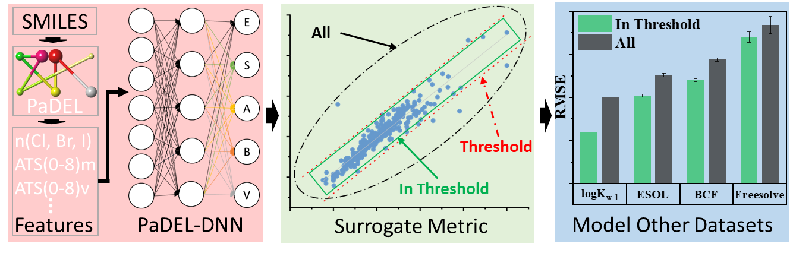

<!--
*** Thanks for checking out the Best-README-Template. If you have a suggestion
*** that would make this better, please fork the repo and create a pull request
*** or simply open an issue with the tag "enhancement".
*** Thanks again! Now go create something AMAZING! :D
-->


<!-- PROJECT SHIELDS -->
<!--
*** I'm using markdown "reference style" links for readability.
*** Reference links are enclosed in brackets [ ] instead of parentheses ( ).
*** See the bottom of this document for the declaration of the reference variables
*** for contributors-url, forks-url, etc. This is an optional, concise syntax you may use.
*** https://www.markdownguide.org/basic-syntax/#reference-style-links
-->


<!-- PROJECT LOGO -->
<br />
<p align="center">
  <a href="https://github.com/cwrukaizhang/LFERsPredictor">
    
  </a>

  <h3 align="center">PaDEL-DNN offline predictor</h3>

  <p align="center">
    This Github project shared some source codes from our recent research for estimating pp-LFER descriptors for neutral organic chemicals!
    <br />
    <a href="https://github.com/cwrukaizhang/LFERsPredictor"><strong>Explore the docs »</strong></a>
    <br />
</p>


<!-- TABLE OF CONTENTS -->


<!-- ABOUT THE PROJECT -->
## About The Project

In our recent research, we used the PaDEL package and the deep neural network to built predictive models for pp-LFER descriptors. This project provided some codes or trained models for estimating pp-LFER descriptorts for new chemicals and reproduce some results presented in our manuscript. For potential users, a step by step explanantion was provided in the following sections.


<!-- GETTING STARTED -->
## Getting Started

To test the built models, a python working environment including some python packages needed to be configurated first. After finishing the configuration of python environment, one can run the python script to launch the offline predicting tool in a web broswer. Then, inputing the "SMILES" of the test chemicals and the estimated LFER descriptors and the surrogate metric results will be displayed.


### Prerequisites

This is an example of how to list packages will be needed to make the build model working properly.
* Required JRE and python packages
  ```sh
  python ==3.9
  Java runtime environment
  tensorflow
  keras
  scikit-learn
  flask
  padelpy
  pubchempy
  rdkit
  ```

### Installation

1. The PaDEL package requires a Java support.
   ```sh
   Download Java SE Runtime Environment and install the software.
   https://www.java.com/en/download/manual.jsp
   ```
2. Create and activate conda virtual environment for the predicting tool in a terminal.
   ```sh
   conda create -n LFER_tool python=3.9
   conda activate LFER_tool
   ```
3. Install required python package
   ```sh
   conda install tensorflow==2.5.0
   conda install keras==2.4.3
   conda install flask==1.1.2
   conda install scikit-learn==0.23.2
   conda install -c rdkit rdkit
   pip install padelpy
   pip install pubchempy
   
   ```
4. Clone the files of this project. Note: Git LFS will be needed, because this project contains some large files. 
   Download and install Git from "https://git-scm.com/downloads" and  Git LFS from "https://git-lfs.github.com/". 
   Input the following code in the Git CMD.
   ```sh
   git LFS install
   git lfs clone https://github.com/cwrukaizhang/LFERsPredictor.git C:/LFER_tool  # clone the project to directory C:/LFER_tool 
   ```
5. Switch to the working directory("C:/LFER_tool") in the first terminal and run the app_new.py file
   ```JS
   python app_new.py
   ```
6. Input the local host address(may vary among different computer or operating system) in the webbroswer and switch to predicting page.
   ```JS
   http://127.0.0.1:80/
   ````

<!-- CONTACT -->
## Contact

Publication Link: [https://pubs.acs.org/doi/10.1021/acs.est.1c05398](https://pubs.acs.org/doi/10.1021/acs.est.1c05398).

Any question in configuring the running environment. Please contact: [zhangkwhut@gmail.com](zhangkwhut@gmail.com)


<!-- ACKNOWLEDGEMENTS -->
## Acknowledgements
* [GitHub Emoji Cheat Sheet](https://www.webpagefx.com/tools/emoji-cheat-sheet)
* [Img Shields](https://shields.io)
* [Choose an Open Source License](https://choosealicense.com)
* [GitHub Pages](https://pages.github.com)
* [Animate.css](https://daneden.github.io/animate.css)
* [Loaders.css](https://connoratherton.com/loaders)
* [Slick Carousel](https://kenwheeler.github.io/slick)
* [Smooth Scroll](https://github.com/cferdinandi/smooth-scroll)
* [Sticky Kit](http://leafo.net/sticky-kit)
* [JVectorMap](http://jvectormap.com)
* [Font Awesome](https://fontawesome.com)


<!-- MARKDOWN LINKS & IMAGES -->
<!-- https://www.markdownguide.org/basic-syntax/#reference-style-links -->
[contributors-shield]: https://img.shields.io/github/contributors/othneildrew/Best-README-Template.svg?style=for-the-badge
[contributors-url]: https://github.com/othneildrew/Best-README-Template/graphs/contributors
[forks-shield]: https://img.shields.io/github/forks/othneildrew/Best-README-Template.svg?style=for-the-badge
[forks-url]: https://github.com/othneildrew/Best-README-Template/network/members
[stars-shield]: https://img.shields.io/github/stars/othneildrew/Best-README-Template.svg?style=for-the-badge
[stars-url]: https://github.com/othneildrew/Best-README-Template/stargazers
[issues-shield]: https://img.shields.io/github/issues/othneildrew/Best-README-Template.svg?style=for-the-badge
[issues-url]: https://github.com/othneildrew/Best-README-Template/issues
[license-shield]: https://img.shields.io/github/license/othneildrew/Best-README-Template.svg?style=for-the-badge
[license-url]: https://github.com/othneildrew/Best-README-Template/blob/master/LICENSE.txt
[linkedin-shield]: https://img.shields.io/badge/-LinkedIn-black.svg?style=for-the-badge&logo=linkedin&colorB=555
[linkedin-url]: https://linkedin.com/in/othneildrew
